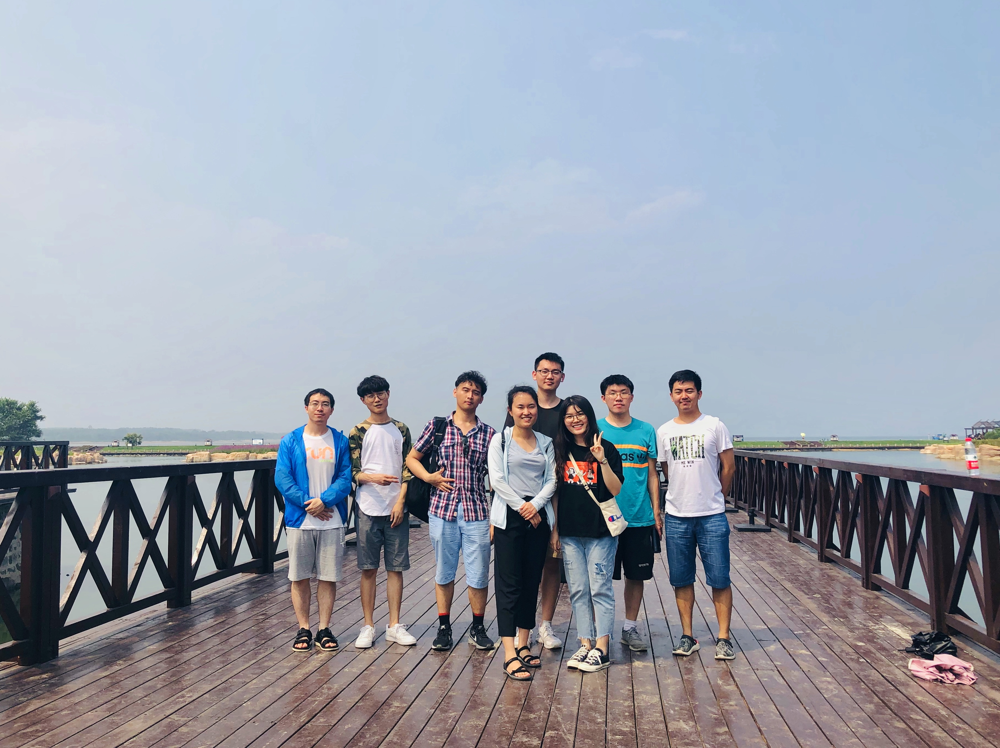



Ph.D. Student

<ul>
    <li>于泉涛：研究方向包括 Internet of Things, LoRa, Chirp Spread Spectrum. </li>
    <li>袁明浩：研究方向包括 Integrated sensing and communication, massive MIMO, and mmWave communications. </li>
    <li>杨天成：研究方向包括 Unmanned aerial vehicle communication, Integrated sensing and communication, Low-altitude economy. </li>
    <li>赵鸿烨：研究方向包括 Integrated sensing and communication, Delay phase based precoding, Wideband beamforming. </li>
    <li>马伯源：研究方向包括 Integrated sensing and communication. </li>
</ul>

Master Student

<ul>
    <li>曹宇昂：研究方向包括  Integrated sensing and communication, radar sensing, Multi-BS collaboration. </li>
    <li>刘人杰：研究方向包括  Satellite communication, Covert communication and anti-jamming technology. </li>
    <li>张家源：研究方向包括 THz communications, Bayesian inference, and AI empowered wireless communications. </li>
    <li>张云厚：研究方向包括 Integrated sensing and communication, Tensor decomposition. </li>
    <li>鲁瑞麒：研究方向包括 Integrated sensing and communication, Movable antenna. </li>
    <li>李典：研究方向包括 Integrated sensing and communication. </li>
    <li>赵超越：研究方向包括 Integrated sensing and communication. </li>
    <li>盛楠：研究方向包括 Integrated sensing and communication. </li>
</ul>

Alumni

<ul> 
    <li>刘子深（2022-2025 ，Master Student）, 香港理工大学（攻读博士学位） </li>
    <li>尚建业（2022-2025 ，Master Student）, 国电南瑞科技股份有限公司 </li> 
    <li>吴铮（2022-2025 ，Master Student）, 国家电网有限公司</li> 
    <li>展羽扬（2021-2024 ，Master Student）, 中国卫星网络集团有限公司 </li>  
    <li>康子奇（2019-2025 ，Master Student）, 中国兵器工业集团 </li> 
</ul>

